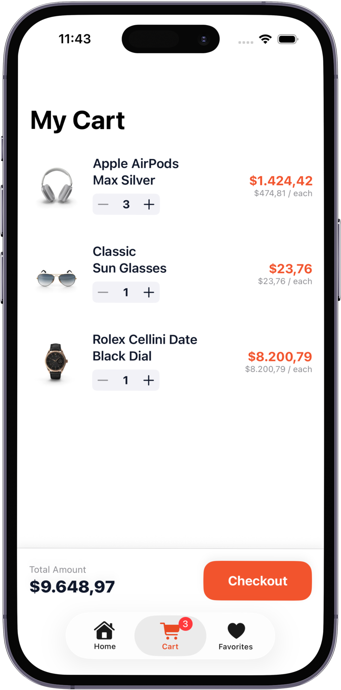
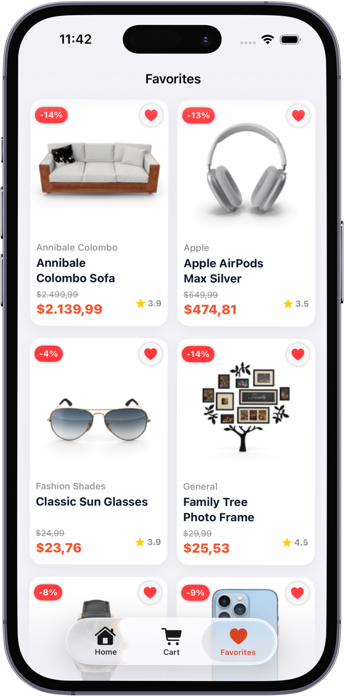

# 🛍️ Swift Market - E-Commerce App

A comprehensive, modern e-commerce application built with **SwiftUI** and **SwiftData**. This project demonstrates a complete shopping experience from product discovery to checkout, following the **MVVM** architecture principles.

## 📱 Features

* **User Authentication:** Secure login system with username/password (DummyJSON Auth).
* **Dynamic Home Page:** Category-based product listing and discount sliders.
* **Product Search:** Real-time search functionality with category filtering.
* **Cart Management:** Add/remove items, adjust quantities, and calculate totals dynamically.
* **Favorites System:** Save products to a local wish list using **SwiftData**.
* **Profile Management:** User details and settings interface.
* **Optimized Images:** Efficient image loading and caching using **Kingfisher**.

## 🛠 Tech Stack

* **Language:** Swift 5
* **UI Framework:** SwiftUI
* **Architecture:** MVVM (Model-View-ViewModel)
* **Storage:** SwiftData (Local persistence for Cart & Favorites)
* **Networking:** URLSession, Async/Await
* **API:** [DummyJSON](https://dummyjson.com/)
* **Dependencies:** Kingfisher (via Swift Package Manager)

## 🏗️ Architecture & Best Practices

The app is built using the **MVVM** design pattern to ensure separation of concerns and testability.

* **Core:** Contains reusable components and main feature views (Home, Cart, Profile).
* **Services:** `ProductService` and `AuthService` handle all API networking.
* **Models:** Decodable structs for API responses and SwiftData models (`CartItem`, `FavoriteItem`).
* **ViewModels:** Handles business logic and state management (e.g., `HomeViewModel`, `CartViewModel`).

## 📸 Screenshots

  
  
  
  

## 🚀 How to Run

1.  Clone the repository.
2.  Open `SwiftMarket.xcodeproj` in Xcode 16+
3.  Wait for Swift Package Manager to fetch **Kingfisher**.
4.  Run on iPhone Simulator (iOS 17+ recommended).

## 👨‍💻 Author

**Cihangir Kankaya**
- LinkedIn: [linkedin.com/in/cihangir-kankaya](https://linkedin.com/in/cihangir-kankaya)
- Portfolio: [Link Gelecek]
